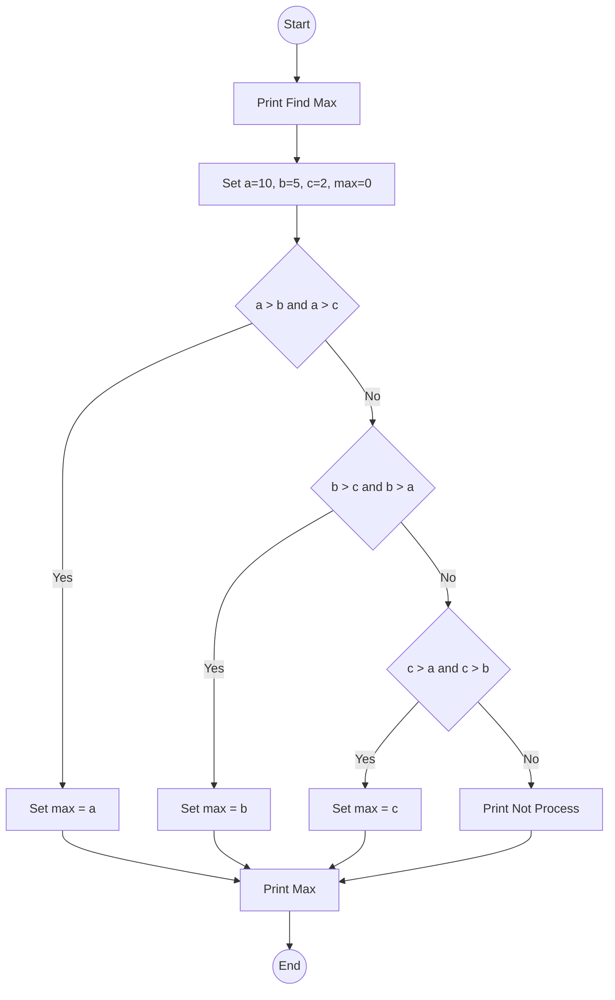

```mermaid
flowchart TD
    A((Start))
    B[Print Find Max]
    C[Set a=10, b=5, c=2, max=0]
    D{a > b and a > c}
    E[Set max = a]
    F{b > c and b > a}
    G[Set max = b]
    H{c > a and c > b}
    I[Set max = c]
    J[Print Not Process]
    K[Print Max]
    L((End))

    A --> B --> C --> D
    D -- Yes --> E --> K
    D -- No --> F
    F -- Yes --> G --> K
    F -- No --> H
    H -- Yes --> I --> K
    H -- No --> J --> K
    K --> L
```
